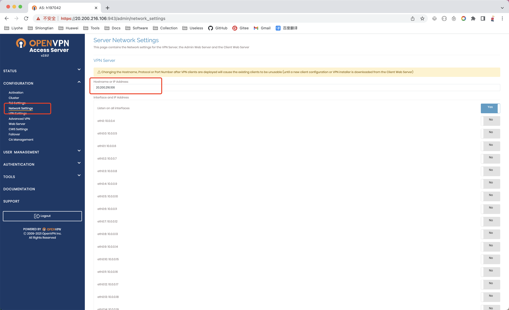
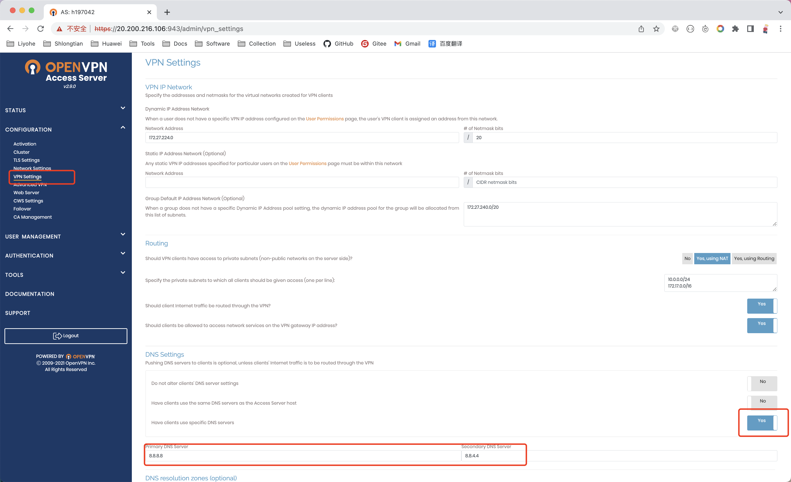
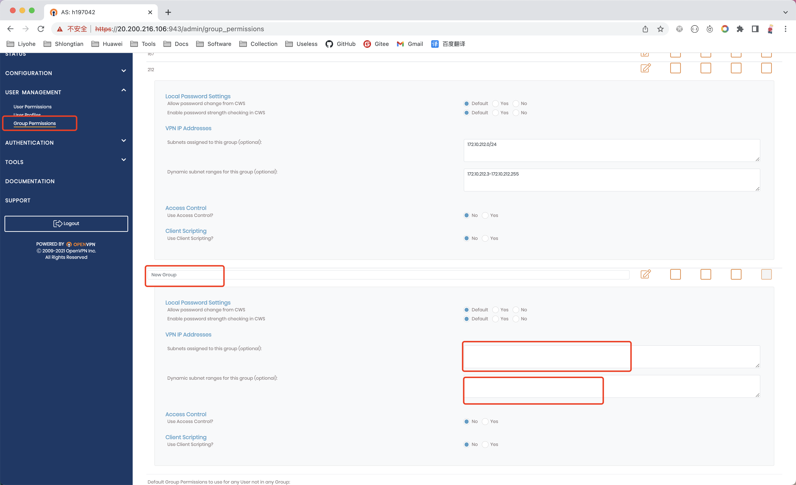
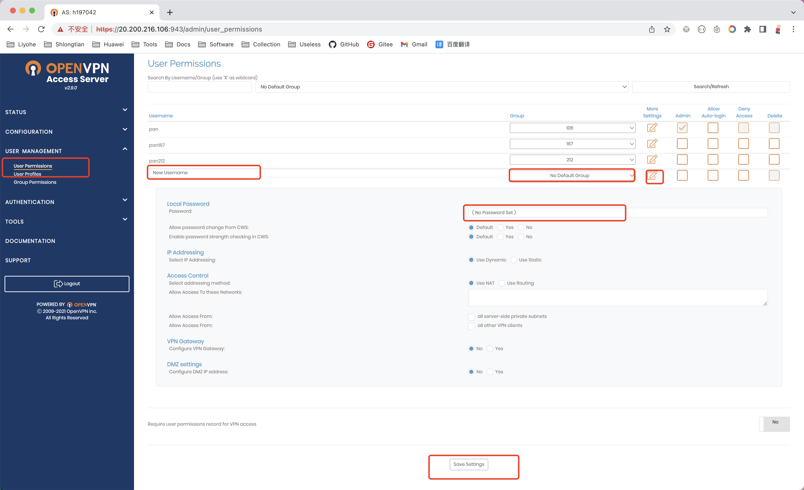
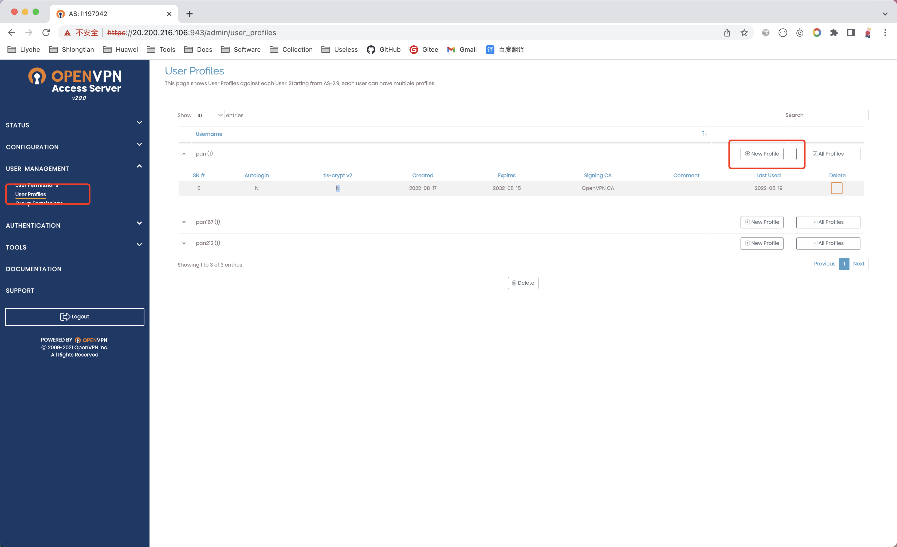

# openvpn-as


## 克隆项目

```bash
git clone https://github.com/liyohecn/docker-openvpn.git
```


## docker-compse

```bash
version: "2.1"
services:
  openvpn:
    image: vpnost/openvpn-as_unlimited
    container_name: openvpn
    cap_add:
      - NET_ADMIN
    environment:
      - PUID=1000
      - PGID=1000
      - TZ=Asia/Shanghai
      - INTERFACE=eth0
    volumes:
      - ./config:/config
    ports:
      - 943:943
      - 9443:9443
      - 1194:1194/udp
    restart: unless-stopped
```


## 进入目录&创建配置目录

```bash
cd openvpn-as

mkdir config
```


## 启动项目

```bash
docker-compose up -d
```


## 访问web页面

```bash
# 地址
https://IP:943
```


## 激活软件

等web页面可以访问并且可以登陆进去后再执行一下操作

**不想激活，也可以使用 镜像 vpnost/openvpn-as_unlimited **

```bash
# 拷贝激活文件
docker cp pyovpn-2.0-py3.6.egg openvpn:/usr/local/openvpn_as/lib/python/

# 重启容器
docker-compose restart
```


## 配置用户

### 设置流程

#### 网络设置

##### Network Settings > VPN Server > Hostname or IP Address

​	**公网IP地址**

<!-- 滑倒最下面点击保存，页面自动刷新后 页面最上方会提示 更新权限，点击 更新权限 -->




##### VPN Settings > VPN IP Network > DNS Settings

**设置 DNS**

<!-- 滑倒最下面点击保存，页面自动刷新后 页面最上方会提示 更新权限，点击 更新权限 -->




##### Group Permissions

**设置 用户组**

> 设置用户组的目的是 将用户划分到不同的网段 ，在对网段设置出站流量 转发到不同的 网卡和IP
>
> NewGroup : 用户组名称
>
> VPN IP Addresses ：
>
> ​	Subnets assigned to this group (optional): 该组内用户的子网网段 例如：172.10.106.0/24
>
> ​	Dynamic subnet ranges for this group (optional): 该组内用户可以分配到的IP地址 例如：172.10.106.3-172.10.106.255

<!-- 滑倒最下面点击保存，页面自动刷新后 页面最上方会提示 更新权限，点击 更新权限 -->




## User Permissions

**设置用户**

> New Username : 用户名
>
> Group：选择上一步中添加的用户组
>
> 保存设置

<!-- 滑倒最下面点击保存，页面自动刷新后 页面最上方会提示 更新权限，点击 更新权限 -->




##### User Profiles > New Profile

​	**获取连接配置文件**




## 配置 出站流量 网卡(正常无需设置)

> 这里设置的目的 是让不同网段的IP 出站流量走不通的IP 出去
>
> 对应 为 VPN 中的 用户组 中设置的网段
>
> **每次网络信息有改动，都会失效，需要重新配置**

```bash
iptables -t nat -I POSTROUTING -p all -s 172.10.167.0/32 -j SNAT --to-source 10.0.0.11

iptables -t nat -I POSTROUTING -p all -s 172.10.212.0/32 -j SNAT --to-source 10.0.0.12
```


